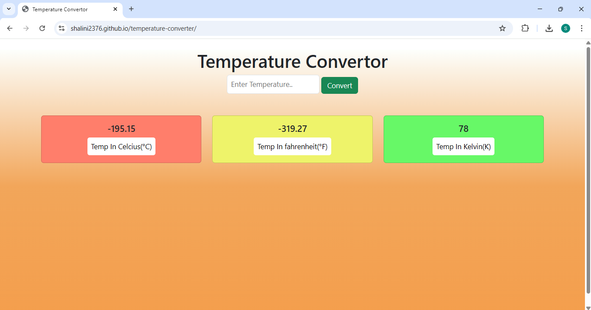

## Temperature Converter

A simple temperature converter built using **HTML, CSS, and JavaScript**.  
This application allows users to convert temperature values between **Celsius, Fahrenheit, and Kelvin** instantly with a clean and responsive interface.

## ✨ Features
- Convert temperatures between Celsius, Fahrenheit, and Kelvin
- Instant conversion on input
- Simple and user-friendly UI
- Input validation for better user experience
- Lightweight and fast (no external libraries)

## 🛠 Tech Stack
- **HTML5**
- **CSS3**
- **JavaScript (ES6)**

## 🚀 How to Run Locally
1. Clone the repository:
  ```
   git clone https://github.com/shalini2376/temperature-converter.git
```
2. Open the project folder.
3. Open index.html in your browser.

No additional setup required.

## 📂 Folder Structure
```
/temperature-converter
│── index.html
│── style.css
│── script.js
│── temprature_convertor.png
│── README.md

```

## 📸 Screenshot



